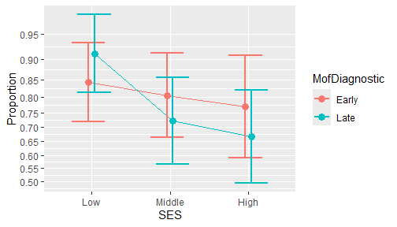
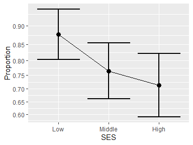

# ANOPA: Analysis of Proportions using Anscombe transform

<!-- badges: start -->

[](https://cran.r-project.org/package=ANOPA)
<!-- badges: end -->

The library `ANOPA` provides easy-to-use tools to analyze proportions .
With it, you can examine if proportions are significantly different
(*show an effect*). In the case where there is more than one factor, you
can also test if the interaction(s) are significant. You can also test
simple effects (a.k.a. *expected marginal* analysis), as well as
post-hoc tests (using Tukey’s *Honestly Significant Difference* test
HSD). Finally, you can assess differences based on orthogonal contrasts.
You can consult Laurencelle & Cousineau (2023) for details.

ANOPA also comes (a) with tools to make a plot of the proportions along
with 95% confidence intervals \[these intervals are adjusted for pair-
wise comparisons; Cousineau, Goulet, & Harding (2021)\]; (b) with tools
to compute statistical power given some *a priori* expected proportions
or sample size to reach a certain statistical power; (c) to generate
random proportions if you wish to perform Monte Carlo simulations on
proportions. In sum, eveything you need to analyse proportions!

The main function is `anopa()` which returns an omnibus analysis of the
proportions for the factors given. For example, if you have a data frame
`ArticleExample2` which contains a column called `s` where the number of
successes per group are stored, and a column called `n` where the group
sizes are stored, then the following performs an analysis of proportions
as a function of the groups based on the columns `SES` and
`MofDiagnostic`:

``` r
w <- anopa( {s; n} ~ SES * MofDiagnostic, ArticleExample2 )
summary(w)
```

    ##                         MS  df        F   pvalue correction    Fcorr pvalcorr
    ## SES               0.022242   2 6.394845 0.001670   1.004652 6.365237 0.001720
    ## MofDiagnostic     0.001742   1 0.500966 0.479076   1.002248 0.499842 0.479569
    ## SES:MofDiagnostic 0.007443   2 2.140035 0.117651   1.040875 2.055997 0.127965
    ## Error(between)    0.003478 Inf

As the results suggest (consult the first three columns), there is a
main effect of the factor SES (F(2, inf) = 6.395, p = .002). A plot of
the proportions can be obtained easily with

``` r
anopaPlot(w) 
```

<!-- -->

or just the main effect figure with

``` r
anopaPlot(w, ~ SES)
```

<!-- -->

If the interaction had been significant, simple effects can be analyzed
from the *expected marginal frequencies* with

``` r
#e <- emProportions(w, ~ SES | MofDiagnostic )
#summary(e)
```

Follow-up analyses include contrasts examinations with
`contrastProportions()`; finally, post-hoc pairwise comparisons can be
obtained with `posthocProportions()`.

Prior to running an experiment, you might consider some statistical
power planning on proportions using `anopaPower2N()` or `anopaN2Power()`
as long as you can anticipate the expected proportions. A convenient
effect size, the f-square and eta-square can be obtained with
`anopaPropTofsq()`.

Finally, `toCompiled()`, `toLong()` and `toWide()` can be used to
present the proportion in other formats.

# Installation

The official **CRAN** version can be installed with

``` r
install.packages("ANOPA")
library(ANOPA)
```

The development version 0.1.1 can be accessed through GitHub:

``` r
devtools::install_github("dcousin3/ANOPA")
library(ANOPA)
```

Note that the package `ANOPA` is named using UPPERCASE letters whereas
the main function `anopa()` is written using lowercase letters.

The library is loaded with

``` r
library(ANOPA)
```

# In sum

As seen, the library `ANOPA` makes it easy to analyze proportions using
the same general vocabulary found in ANOVAs.

The complete documentation is available on this
[site](https://dcousin3.github.io/ANOPA/).

A general introduction to the `ANOPA` framework underlying this library
can be found at Laurencelle & Cousineau (2023).

# References

<div id="refs" class="references csl-bib-body hanging-indent"
entry-spacing="0" line-spacing="2">

<div id="ref-cgh21" class="csl-entry">

Cousineau, D., Goulet, M.-A., & Harding, B. (2021). Summary plots with
adjusted error bars: The superb framework with an implementation in R.
*Advances in Methods and Practices in Psychological Science*, *4*, 1–18.
<https://doi.org/10.1177/25152459211035109>

</div>

<div id="ref-lc23" class="csl-entry">

Laurencelle, L., & Cousineau, D. (2023). Analysis of proportions using
arcsine transform with any experimental design. *Frontiers in
Psychology*, *13*, 1045436. <https://doi.org/10.3389/fpsyg.2022.1045436>

</div>

</div>
